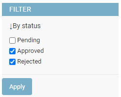

# DjangoAdminFilters library

[](https://github.com/vb64/django.admin.filters/actions?query=workflow%3Apep257)
[](https://github.com/vb64/django.admin.filters/actions?query=workflow%3Adjango3)
[](https://github.com/vb64/django.admin.filters/actions?query=workflow%3Adjango4)
[](https://github.com/vb64/django.admin.filters/actions?query=workflow%3Adjango5)
[](https://app.codacy.com/gh/vb64/django.admin.filters/dashboard?utm_source=gh&utm_medium=referral&utm_content=&utm_campaign=Badge_grade)
[](https://app.codacy.com/gh/vb64/django.admin.filters/dashboard?utm_source=gh&utm_medium=referral&utm_content=&utm_campaign=Badge_coverage)
[](https://pypistats.org/packages/django-admin-list-filters)

[In Russian](READMEru.md)

The free, open-source DjangoAdminFilters library is designed to filter objects in the Django admin site.
The library provide few filters for this purpose.

- `MultiChoice`: multi choice selection with checkboxes for CharField and IntegerField fields with 'choices' option
- `MultiChoiceExt`: another version of previous filter, that allows filtering by custom defined properties
- `DateRange`: set a custom date range using `input` fields
- `DateRangePicker`: set a custom date range using javascript widget for select datetime from calendar

MultiChoice and MultiChoiceExt | DateRange | DateRangePicker
:------:|:-----:|:----:
 |  | 

For javascript widget for DateRangePicker was used code from [date-and-time-picker project](https://github.com/polozin/date-and-time-picker) with merged [pull request](https://github.com/polozin/date-and-time-picker/pull/4/files), that allow to select dates before current.

## Installation

```bash
pip install django-admin-list-filters
```

To connect library to your project, add `django_admin_filters` to the `INSTALLED_APPS` list  in your `settings.py` file.

```python

INSTALLED_APPS = (

...

  'django_admin_filters',
)
```

Then connect the static files of the library.

```bash
manage.py collectstatic
```

## Initial data

Let's say we have a table in the database. The records contain follows fields.

```python
# models.py

from django.db import models

STATUS_CHOICES = (
  ('P', 'Pending'),
  ('A', 'Approved'),
  ('R', 'Rejected'),
)

class Log(models.Model):
    text = models.CharField(max_length=100)

    timestamp1 = models.DateTimeField(default=None, null=True)
    timestamp2 = models.DateTimeField(default=None, null=True)

    status = models.CharField(max_length=1, default='P', choices=STATUS_CHOICES)

    is_online = models.BooleanField(default=False)
    is_trouble1 = models.BooleanField(default=False)
    is_trouble2 = models.BooleanField(default=False)
```

## Shared settings for all filters in the library

You can customize the appearance and behavior of filters to suit your needs by inheriting the filter classes from the library and overriding some of the attributes.
All library filters support the following attributes.

```python
from django_admin_filters import MultiChoice

class MyChoicesFilter(MultiChoice):
    FILTER_LABEL = "Select options"
    BUTTON_LABEL = "Apply"
```

- FILTER_LABEL: Filter title
- BUTTON_LABEL: Title for filter apply button

## MultiChoice filter

For model fields of type `CharField` or `IntegerField` defined using the `choices` parameter (for example, the 'status' field in the `Log` model), you can use the MultiChoice filter.
Values  of the parameter `choices` will be displayed as checkboxes.

To use MultiChoice filter, you need to specify them in the `admin.py` file in the `list_filter` attribute of the corresponding class.

```python
# admin.py

from django.contrib import admin
from django_admin_filters import MultiChoice
from .models import Log

class StatusFilter(MultiChoice):
    FILTER_LABEL = "By status"

class Admin(admin.ModelAdmin):
    list_display = ['text', 'status']
    list_filter = [('status', StatusFilter)]

admin.site.register(Log, Admin)
```

In the Django admin panel, check the required checkboxes in the filter and click the "Apply" button.
If all filter checkboxes are unchecked and the apply filter button is pressed, than the filter will not been aplied and all records will be displayed.

## MultiChoiceExt filter

Sometimes you need to filter data by a custom defined property that does not match a single field in the model.

For example, in the `Log` model of the source data, there are three boolean fields.

```python
    is_online = models.BooleanField(default=False)
    is_trouble1 = models.BooleanField(default=False)
    is_trouble2 = models.BooleanField(default=False)
```

For this model, we define the `color` property as follows.

- The `color` property has the value 'red' if the field `is_online == False`.
- If `is_online == True` and both `is_trouble1` and `is_trouble2` fields are False, then the value of the property is 'green'.
- If `is_online == True` and at least one of the fields `is_trouble1` and `is_trouble2` is True, then the property has the value 'yellow'.

```python
# models.py

    @property
    def color(self):
        status = 'red'
        if self.is_online:
            status = 'green'
            if self.is_trouble1 or self.is_trouble2:
                status = 'yellow'

        return status
```

To filter data by such a property in the Django admin panel, you can use the MultiChoiceExt filter.
In the `options` attribute, you need to specify a list of checkboxes that will be displayed when using the filter.

Each element of the list consists of three values.

- a unique string to be used in the GET request parameter
- checkbox label
- filtering expression applied to the DB model in the form of [Django Q-objects](https://docs.djangoproject.com/en/dev/topics/db/queries/#complex-lookups-with-q-objects)

In the `parameter_name` attribute, you need to specify the name of the GET request parameter for sending filter data.

For our example, the code will look like this.

```python
# admin.py

from django.db.models import Q
from django_admin_filters import MultiChoiceExt

class ColorFilter(MultiChoiceExt):
    FILTER_LABEL = "By color"
    parameter_name = "color"
    options = [
      ('red', 'Red', Q(is_online=False)),
      ('yellow', 'Yellow', Q(is_online=True) & (Q(is_trouble1=True) | Q(is_trouble2=True))),
      ('green', 'Green', Q(is_online=True) & Q(is_trouble1=False) & Q(is_trouble2=False)),
    ]

class Admin(admin.ModelAdmin):
    list_display = ['text', 'color']
    list_filter = [ColorFilter]

admin.site.register(Log, Admin)
```

Otherwise, the behavior and settings of the `MultiChoiceExt` filter are similar to the `MultiChoice` filter described earlier.

## DateRange and DateRangePicker filters

To use filters with a date interval, you need to specify them in the `admin.py` file in the `list_filter` attribute of the corresponding class.

```python
# admin.py

from django.contrib import admin
from django_admin_filters import DateRange, DateRangePicker
from .models import Log

class Admin(admin.ModelAdmin):
    list_display = ['text', 'timestamp1', 'timestamp2']
    list_filter = (('timestamp1', DateRange), ('timestamp2', DateRangePicker))

admin.site.register(Log, Admin)
```

### Customization for DateRange filter

```python
# admin.py

from django_admin_filters import DateRange

class MyDateRange(DateRange):
    FILTER_LABEL = "Data range"
    BUTTON_LABEL = "Set range"
    FROM_LABEL = "From"
    TO_LABEL = "To"
    ALL_LABEL = 'All'
    CUSTOM_LABEL = "custom range"
    NULL_LABEL = "no date"
    DATE_FORMAT = "YYYY-MM-DD HH:mm"

    is_null_option = True

    options = (
      ('1da', "24 hours ahead", 60 * 60 * 24),
      ('1dp', "24 hours in the past", 60 * 60 * -24),
    )
```

You can override the following attributes.

- `FILTER_LABEL`: Title of the filter.
- `BUTTON_LABEL`: Text on the apply filter button.
- `FROM_LABEL`: The label of the start date field.
- `TO_LABEL`: The label of the end date field.
- `ALL_LABEL`: The label of the menu item for displaying all records.
- `CUSTOM_LABEL`: The label of the menu item when date range is set.
- `NULL_LABEL`: The label of the menu item for displaying records without date.
- `is_null_option`: Set this attribute to `False` to remove the option to display record without date from the filter menu.
- `parameter_start_mask`: Mask of the GET request parameter name for the start date of the date range.
- `parameter_end_mask`: Mask of the GET request parameter name for the end date of the date range.
- `DATE_FORMAT`: Hint about the format of the date and time fields.

You can change the date/time input format to your own.
However, you may need to override the `to_dtime` method as well.
This method is used to convert a user-entered string into a `datetime` value.
By default, the method is defined as follows.

```python
@staticmethod
def to_dtime(text):
    try:
        return datetime.fromisoformat(text)
    except ValueError:
        return None
```

The `options` attribute specifies filter menu items that allow you to select data from the current moment to an offset of a specified number of seconds in the past or future.
Each element of the `options` list contains three values.

- A unique string to use in the GET request parameters. Except for the strings 'custom' and 'empty' which are used by the filter.
- The title of the item in the filter menu.
- Offset in seconds relative to the current moment. A negative value specifies an offset to the past.

### Customization for DateRangePicker filter

The `DateRangePicker` filter with a javascript calendar date/time picker widget is derived from the `DateRange` filter and allows you to override all the attributes described above.
Also, additional attributes can be overridden in `DateRangePicker`.

```python
# admin.py

from django_admin_filters import DateRangePicker

class MyDateRangePicker(DateRangePicker):
    WIDGET_LOCALE = 'en'
    WIDGET_BUTTON_LABEL = "Set"
    WIDGET_WITH_TIME = True

    WIDGET_START_TITLE = 'Start date'
    WIDGET_START_TOP = -350
    WIDGET_START_LEFT = -400

    WIDGET_END_TITLE = 'End date'
    WIDGET_END_TOP = -350
    WIDGET_END_LEFT = -400
```

- WIDGET_LOCALE: The language code for display the names of the months and days of the week. By default is the value of the `LANGUAGE_CODE` item in your project's `settings.py` file.
- WIDGET_BUTTON_LABEL: The label of the select button.
- WIDGET_WITH_TIME: Set this attribute to `False` if you only want to select a date without a time.
- WIDGET_START_TITLE: The title of the widget when selecting the start date of the interval.
- WIDGET_START_TOP: The vertical offset of the widget's calendar window when selecting the start date of the interval.
- WIDGET_START_LEFT: The horizontal offset of the widget's calendar window when selecting the start date of the interval.
- WIDGET_END_TITLE: The title of the widget when selecting the end date of the interval.
- WIDGET_END_TOP: The vertical offset of the widget's calendar window when selecting the end date of the interval.
- WIDGET_END_LEFT: The horizontal offset of the widget's calendar window when selecting the end date of the interval.

## Usage example

You can run an example of using the library on your local host.

On the Windows platform, you must first install the following programs.

- [Python3](https://www.python.org/downloads/release/python-3712/)
- GNU [Unix Utils](http://unxutils.sourceforge.net/) for operations via makefile
- [Git for Windows](https://git-scm.com/download/win) to access the source code repository.

Then clone the repository and run the installation, specifying the path to Python 3.

```bash
git clone git@github.com:vb64/django.admin.filters.git
cd django.admin.filters
make setup PYTHON_BIN=/usr/bin/python3
```

Collect static files and create a database.

```bash
make static
make db
```

Create a database superuser by specifying a login and password for it.

```bash
make superuser
```

Run example.

```bash
make example
```

Open `http://127.0.0.1:8000/admin/` in a browser to view the example site.
To enter the admin panel you need to use the login and password that were set when creating the superuser.

## Related projects

- [django-admin-list-filter-dropdown](https://github.com/mrts/django-admin-list-filter-dropdown) `DropdownFilter` class that renders as a drop-down in the filtering sidebar for Django admin list views.
