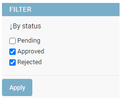
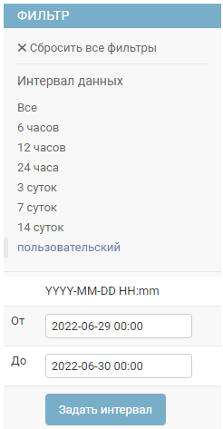
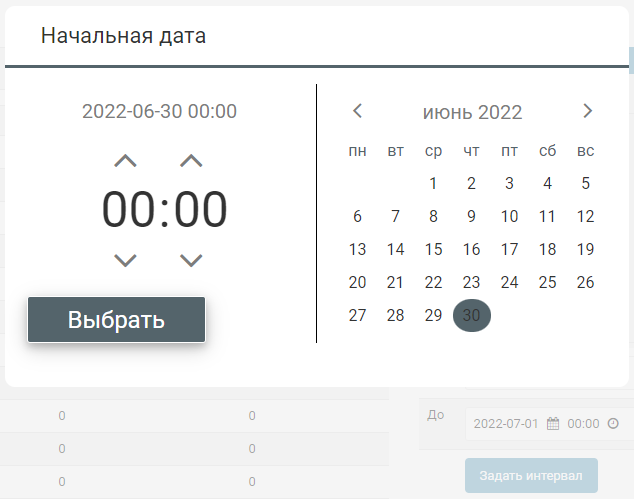

# Библиотека DjangoAdminFilters

[На английском](README.md)

Бесплатная, с открытым исходным кодом библиотека DjangoAdminFilters позволяет использовать несколько дополнительных фильтров в таблицах админки Django.

-   `MultiChoice`: множественный выбор с чекбоксами для полей типа CharField и IntegerField, имеющих опцию 'choices'
-   `MultiChoiceExt`: другая версия предыдущего фильтра, который позволяет фильтровать по заданным пользователем свойствам
-   `DateRange`: позволяет задавать пользовательский интервал дат с использованием полей `input`
-   `DateRangePicker`: позволяет задавать пользовательский интервал дат с использованием javascript виджета выбора даты/времени из календаря

 MultiChoice и MultiChoiceExt | DateRange | DateRangePicker
:------------:|:-------------:|:------------:
 |  | 

Для javascript виджета в фильтре DateRangePicker используется код [проекта date-and-time-picker](https://github.com/polozin/date-and-time-picker) с внедренным [пул-реквестом](https://github.com/polozin/date-and-time-picker/pull/4/files), позволяющем выбирать в этом виджете даты ранее текущей.

## Установка

```bash
pip install django-admin-list-filters
```

Для подключения библиотеки к проекту нужно добавить `django_admin_filters` в список `INSTALLED_APPS` в файле `settings.py`.

```python

INSTALLED_APPS = (

...

  'django_admin_filters',
)
```

Затем подключите статические файлы библиотеки.

```bash
manage.py collectstatic
```

## Исходные данные

Допустим, у нас в БД имеется таблица, записи которой содержат следующие поля.

```python
# models.py
from django.db import models

STATUS_CHOICES = (
  ('P', 'Pending'),
  ('A', 'Approved'),
  ('R', 'Rejected'),
)

class Log(models.Model):
    text = models.CharField(max_length=100)

    timestamp1 = models.DateTimeField(default=None, null=True)
    timestamp2 = models.DateTimeField(default=None, null=True)

    status = models.CharField(max_length=1, default='P', choices=STATUS_CHOICES)

    is_online = models.BooleanField(default=False)
    is_trouble1 = models.BooleanField(default=False)
    is_trouble2 = models.BooleanField(default=False)
```

## Общие настройки для всех фильтров библиотеки

Вы можете настроить внешний вид и поведение фильтров под свои требования путем наследования классов фильтров из библиотеки и переопределения некоторых атрибутов.
Все фильтры библиотеки поддерживают следующие атрибуты.

```python
from django_admin_filters import MultiChoice

class MyChoicesFilter(MultiChoice):
    FILTER_LABEL = "Выберите опции"
    BUTTON_LABEL = "Применить"
```

-   FILTER_LABEL: Заголовок фильтра
-   BUTTON_LABEL: Заголовок кнопки применения фильтра

## Фильтр MultiChoice

Для полей модели типа `CharField` или `IntegerField`, определенных с использованием параметра `choices` (например, поле 'status' в модели `Log`), можно использовать фильтр MultiChoice.
Значения из параметра `choices` будут отображаться в виде чекбоксов.

Для использования фильтра MultiChoice, укажите его в атрибуте `list_filter` соответствующего класса файла `admin.py`.

```python
# admin.py
from django.contrib import admin
from django_admin_filters import MultiChoice
from .models import Log

class StatusFilter(MultiChoice):
    FILTER_LABEL = "По статусу"
    BUTTON_LABEL = "Применить"

class Admin(admin.ModelAdmin):
    list_display = ['text', 'status']
    list_filter = [('status', StatusFilter)]

admin.site.register(Log, Admin)
```

В админке Django отметьте нужные чекбоксы в фильтре и нажмите кнопку "Применить".
Если пометка снята со всех чекбоксов фильтра и нажата кнопка применения фильтра, то фильтр не будет действовать и отобразятся все записи.

## Фильтр MultiChoiceExt

Иногда нужно фильтровать данные по виртуальному свойству, которому не соответствует единственное поле модели.

Например, в модели `Log` исходных данных есть три булевых поля.

```python
    is_online = models.BooleanField(default=False)
    is_trouble1 = models.BooleanField(default=False)
    is_trouble2 = models.BooleanField(default=False)
```

Для этой модели мы определяем свойство `color` следующим образом.

-   Свойство `color` имеет значение 'red', если поле `is_online == False`.
-   Если `is_online == True` и оба поля `is_trouble1` и `is_trouble1` имеют значение False, то свойство имеет значение 'green'.
-   Если `is_online == True` и хотя бы одно из полей `is_trouble1` и `is_trouble1` имеет значение True, то свойство имеет значение 'yellow'.

```python
# models.py
    @property
    def color(self):
        status = 'red'
        if self.is_online:
            status = 'green'
            if self.is_trouble1 or self.is_trouble2:
                status = 'yellow'

        return status
```

Для фильтрации данных по такому свойству в админке Django можно использовать фильтр MultiChoiceExt.
В атрибуте `options` нужно указать список чекбоксов, который будет отображаться при использовании фильтра.

Каждый элемент списка состоит из трех значений.

-   уникальная строка, которая будет использоваться в параметре GET-запроса
-   текст у чекбокса
-   применяемое к таблице модели в БД выражение фильтрации в виде [Q-объектов Django](https://docs.djangoproject.com/en/dev/topics/db/queries/#complex-lookups-with-q-objects)

В атрибуте `parameter_name` нужно указать имя параметра GET-запроса, в котором будут передаваться данные фильтра.

Для нашего примера код будет таким.

```python
# admin.py
from django.db.models import Q
from django_admin_filters import MultiChoiceExt

class ColorFilter(MultiChoiceExt):
    FILTER_LABEL = "По цвету"
    parameter_name = "color"
    options = [
      ('red', 'Red', Q(is_online=False)),
      ('yellow', 'Yellow', Q(is_online=True) & (Q(is_trouble1=True) | Q(is_trouble2=True))),
      ('green', 'Green', Q(is_online=True) & Q(is_trouble1=False) & Q(is_trouble2=False)),
    ]

class Admin(admin.ModelAdmin):
    list_display = ['text', 'color']
    list_filter = [ColorFilter]

admin.site.register(Log, Admin)
```

В остальном поведение и настройки фильтра `MultiChoiceExt` аналогичны описанному ранее фильтру `MultiChoice`.

## Фильтры DateRange и DateRangePicker

Для использования фильтров с интервалом дат нужно в файле `admin.py` указать их в атрибуте `list_filter` соответствующего класса.

```python
# admin.py
from django.contrib import admin
from django_admin_filters import DateRange, DateRangePicker
from .models import Log

class Admin(admin.ModelAdmin):
    list_display = ['text', 'timestamp1', 'timestamp2']
    list_filter = (('timestamp1', DateRange), ('timestamp2', DateRangePicker))

admin.site.register(Log, Admin)
```

## Настройка фильтра DateRange

```python
# admin.py
from django_admin_filters import DateRange

class MyDateRange(DateRange):
    FILTER_LABEL = "Интервал данных"
    BUTTON_LABEL = "Задать интервал"
    FROM_LABEL = "От"
    TO_LABEL = "До"
    ALL_LABEL = 'Все'
    CUSTOM_LABEL = "пользовательский"
    NULL_LABEL = "без даты"
    DATE_FORMAT = "YYYY-MM-DD HH:mm"

    is_null_option = True

    options = (
      ('1da', "24 часа вперед", 60 * 60 * 24),
      ('1dp', "последние 24 часа", 60 * 60 * -24),
    )
```

Можно переопределять следующие атрибуты.

-   `FROM_LABEL`: Текст у поля начальной даты.
-   `TO_LABEL`: Текст у поля конечной даты.
-   `ALL_LABEL`: Текст пункта меню фильтра для отображения всех записей.
-   `CUSTOM_LABEL`: Текст пункта меню фильтра при использовании интервала дат.
-   `NULL_LABEL`: Текст пункта меню фильтра для отображения записей без даты.
-   `is_null_option`: Установите этот атрибут в `False`, чтобы убрать из меню фильтра пункт отображения записей без даты.
-   `DATE_FORMAT`: Текст подсказки о формате полей даты и времени.

Вы можете изменить формат ввода даты/времени на собственный.
Но при этом вам возможно будет необходимо также переопределить метод `to_dtime`.
Этот метод используется для преобразования введенной пользователем строки в значение `datetime`.
По умолчанию метод определен следующим образом.

```python
@staticmethod
def to_dtime(text):
    try:
        return datetime.fromisoformat(text)
    except ValueError:
        return None
```

Атрибут `options` задает пункты меню фильтра, позволяющие выбирать данные от текущего момента до смещения на заданное количество секунд в прошлом либо будущем.
Каждый элемент списка `options` содержит три значения.

-   Уникальная строка для использования в параметрах GET запроса. Кроме строк 'custom' и 'empty', которые используются фильтром.
-   Заголовок пункта в меню фильтра.
-   Смещение в секундах относительно текущего момента. Отрицательное значение задает смещение в прошлое.

## Настройка фильтра DateRangePicker

Фильтр `DateRangePicker` с javascript виджетом выбора даты/времени из календаря является производным от фильтра `DateRange` и позволяет переопределять все описанные выше атрибуты.
Кроме того, в `DateRangePicker` можно переопределить дополнительные атрибуты.

```python
# admin.py
from django_admin_filters import DateRangePicker

class MyDateRangePicker(DateRangePicker):
    WIDGET_LOCALE = 'ru'
    WIDGET_BUTTON_LABEL = "Выбрать"
    WIDGET_WITH_TIME = True

    WIDGET_START_TITLE = 'Начальная дата'
    WIDGET_START_TOP = -350
    WIDGET_START_LEFT = -400

    WIDGET_END_TITLE = 'Конечная дата'
    WIDGET_END_TOP = -350
    WIDGET_END_LEFT = -400
```

-   WIDGET_LOCALE: Код языка, на котором виджет будет отображать названия месяцев и дней недели. По умолчанию используется значение параметра `LANGUAGE_CODE` файла `settings.py` вашего проекта.
-   WIDGET_BUTTON_LABEL: Текст кнопки выбора виджета.
-   WIDGET_WITH_TIME: Установите значение этого атрибута в `False`, если вам требуется только выбор даты без времени.
-   WIDGET_START_TITLE: Заголовок виджета при выборе начальной даты интервала.
-   WIDGET_START_TOP: Смещение по вертикали окна календаря виджета при выборе начальной даты интервала.
-   WIDGET_START_LEFT: Смещение по горизонтали окна календаря виджета при выборе начальной даты интервала.
-   WIDGET_END_TITLE: Заголовок виджета при выборе конечной даты интервала.
-   WIDGET_END_TOP: Смещение по вертикали окна календаря виджета при выборе конечной даты интервала.
-   WIDGET_END_LEFT: Смещение по горизонтали окна календаря виджета при выборе конечной даты интервала.

## Пример использования

Вы можете запустить работающий на локальном компьютере пример использования библиотеки.

На платформе Windows для этого нужно предварительно установить следующие программы.

-   [Python3](https://www.python.org/downloads/release/python-3712/)
-   GNU [Unix Utils](http://unxutils.sourceforge.net/) для операций через makefile
-   [Git for Windows](https://git-scm.com/download/win) для доступа к репозитарию исходных кодов.

Затем склонировать репозитарий и запустить установку, указав путь на Python 3.

```bash
git clone git@github.com:vb64/django.admin.filters.git
cd django.admin.filters
make setup PYTHON_BIN=/usr/bin/python3
```

Подключить статические файлы библиотеки и создать базу данных.

```bash
make static
make db
```

Создать суперюзера базы данных, указав для него логин и пароль.

```bash
make superuser
```

Запустить пример.

```bash
make example
```

Открыть в браузере адрес `http://127.0.0.1:8000/admin/` для просмотра сайта примера.
Для входа в админку нужно использовать логин и пароль, заданные при создании суперюзера.
